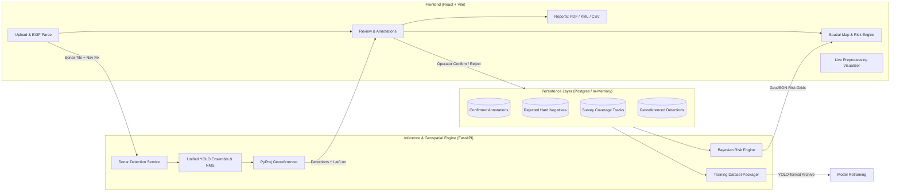
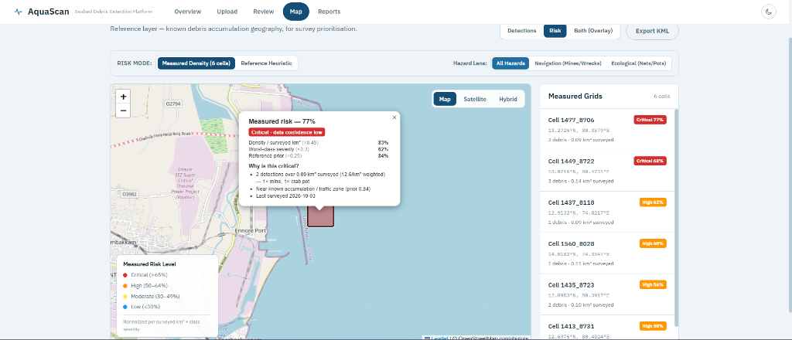
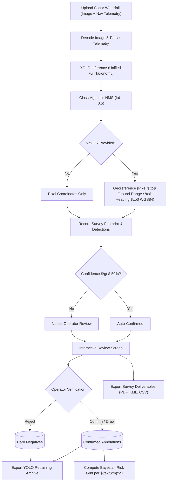

# AquaScan — Marine Debris & Hazard Detection


Automated detection and georeferencing of marine debris and underwater hazards (ghost nets, crab pots, shipwrecks, mines, ordnance) in side-scan sonar imagery. Features dead-reckoning georeferencing from vessel navigation fixes, a Bayesian-regularized risk zone engine, and a human-in-the-loop active-learning loop.

Built for **Smart India Hackathon 2026**, problem statement **SIH26057** (Ministry of Earth Sciences / NIOT), by **Team Aquanauts**, Ramaiah Institute of Technology.

### 🌊 [View it live → marine-debris-detector-t79s.vercel.app](https://marine-debris-detector-t79s.vercel.app)

<br/>

<div align="center">
  
  <p><em>AquaScan Autonomous Debris & Subsea Hazard Platform</em></p>
</div>

---

## Problem Statement

**SIH26057 — Ministry of Earth Sciences / National Institute of Ocean Technology (NIOT).**  
Side-scan sonar surveys of the seabed generate vast volumes of acoustic waterfall imagery. Finding marine hazards—derelict fishing gear, ghost nets, shipwrecks, and explosive ordnance—currently demands hours of manual, frame-by-frame scrubbing by specialized hydrographers. Manual review is slow, prone to fatigue, hard to scale across extensive coastal zones, and rarely translates into georeferenced, GIS-ready recovery coordinates.

**Our Solution:** AquaScan automates contact detection across the entire debris taxonomy, georeferences every contact to real-world WGS84 coordinates, computes empirical debris accumulation risk grids per surveyed area, and captures hydrographer corrections to continually refine model performance.

---

## Core Features

- **Unified Multi-Class Hazard Detection:** A single-pass YOLO detection architecture trained across the complete marine hazard taxonomy (ghost nets, derelict crab pots, shipwrecks, naval mines/MILCO, aircraft wreckage, and person-in-water). Class-agnostic Non-Maximum Suppression (NMS) resolves overlapping acoustic returns.
- **Dead-Reckoning Georeferencing:** Converts pixel offsets into metric ground range, projects offsets along vessel heading vectors, and transforms local coordinates into global UTM / WGS84 positions via `pyproj`.
- **Data-Driven Risk Zone Engine:** Evaluates debris density per **surveyed square kilometer ($\text{km}^2$)** rather than misleading raw counts. Utilizes Empirical Bayes (Gamma-Poisson) shrinkage, a taxonomic severity hierarchy (mines $\gg$ pots), human verification weighting, and proximity priors.
- **Dedicated Hazard Lenses:** Instant filtering between **Navigation Hazards** (mines, wrecks, life safety) and **Ecological Threats** (ghost nets, derelict traps).
- **Explainable Sonar Preprocessing:** Live client-side column-gain equalization (mitigating waterfall striping) and sonar-tuned CLAHE (contrast enhancement) for transparent operator inspection.
- **Human-in-the-Loop Active Learning:** Three-tier automated confidence triage (Auto-Confirmed $\ge 50\%$, Needs-Review, Rejected). Hydrographer corrections feed directly into structured YOLO training archives with hard negatives.
- **Dual-Mode Persistence:** Automatically uses Neon serverless PostgreSQL when configured, or a zero-configuration in-memory fallback for local development out of the box.
- **Survey-Grade GIS Deliverables:** Export filtered contacts as GIS-ready KML layers (Google Earth / QGIS / ArcGIS), GeoJSON, CSV, or formatted multi-page hydrographic survey PDF reports.

---

## Tech Stack

| Layer | Technologies | Purpose |
|---|---|---|
| **Frontend** | React 18, Vite, React Router | Fast, responsive single-page application |
| **Mapping & GIS** | Leaflet, React-Leaflet, PyProj | Interactive spatial layers, UTM transformations, KML generation |
| **Backend** | Python 3.11+, FastAPI, Uvicorn | High-throughput asynchronous REST backend |
| **Machine Learning** | Ultralytics YOLO, PIL, OpenCV | Side-scan sonar object detection & acoustic filtering |
| **Database** | Neon Serverless PostgreSQL / In-Memory | Annotation persistence, survey footprints, hard negatives |
| **Styling & UI** | CSS Custom Properties, Tailwind (Landing) | High-contrast oceanic dark mode & sonar palette |
| **Deployment** | Vercel (Frontend), Railway + Docker (Backend) | Containerized cloud infrastructure |

---

## Architecture



---

## System Walkthrough & Screenshots

### 1. Spatial Map & Measured Risk Grids
Inspect georeferenced contacts on OpenStreetMap, Esri Satellite, or Hybrid layers. Toggle between empirical **Measured Density Grids** (derived from survey track density) and heuristic **Reference Prior Zones**.

<div align="center">
  
  <p><em>Data-driven measured risk grid with natural-language reasoning popup, component breakdown, and hazard lens filter</em></p>
</div>

<br/>

<div align="center">
  <table>
    <tr>
      <td align="center">
        <br/>
        <em>Satellite Basemap & Known Prior Zones</em>
      </td>
      <td align="center">
        <br/>
        <em>Coastal Transects & Detections</em>
      </td>
    </tr>
  </table>
</div>

---

### 2. Overview Dashboard
Real-time survey telemetry, model latency benchmarks, system memory utilization, and class distribution breakdown.

<div align="center">
  
  <p><em>Survey telemetry, model inference stats, and recent sonar scan lines</em></p>
</div>

---

### 3. Operator Review & Explainable Preprocessing
The review interface presents detected bounding boxes ranked by confidence. Operators can confirm, reject, or draw missed objects.

<div align="center">
  <table>
    <tr>
      <td align="center">
        <br/>
        <em>Acoustic Waterfall & Bounding Boxes</em>
      </td>
      <td align="center">
        <br/>
        <em>Live Normalization & CLAHE Stages</em>
      </td>
    </tr>
  </table>
</div>

---

## Detection & Risk Pipeline



---

## Results & Benchmarks

All evaluation figures reflect precision, recall, and $\text{mAP}_{50}$ measured on our held-out test split using identical training configurations.

### 1. Preprocessing Impact
Ablation study on the crab-pot side-scan sonar dataset:

| Configuration | Precision | Recall | $\text{mAP}_{50}$ | Relative Gain |
|---|---|---|---|---|
| Raw Sonar Imagery | 0.4730 | 0.4000 | 0.3835 | Baseline |
| + Column Gain Normalization | 0.5962 | 0.4853 | 0.4592 | $+19.7\%$ |
| **+ Sonar-Aware Augmentation** | **0.7449** | **0.6528** | **0.6021** | **$+57.0\%$** |

### 2. Model Size Comparison
Evaluated across identical 3k-image acoustic partitions:

| Model Architecture | Precision | Recall | $\text{mAP}_{50}$ | Weights Size | Deployment Status |
|---|---|---|---|---|---|
| **YOLO26n (Nano)** | **0.4730** | **0.4000** | **0.3860** | **5.3 MB** | **Shipped & Active** |
| YOLO26s (Small) | 0.3995 | 0.4261 | 0.3735 | 22.1 MB | Evaluated |
| YOLO26m (Medium) | 0.4710 | 0.4520 | 0.4260 | 49.6 MB | Evaluated |

*Scaling up beyond Nano yielded marginal gains within the measurement noise floor ($\pm 0.05$). The 5.3 MB Nano variant was selected for edge readiness on unaccelerated CPU hardware.*

### 3. Runtime Benchmarks
- **CPU Inference:** 224 ms per tile
- **Throughput:** ~4.5 FPS on standard CPU
- **Model Size:** 5.3 MB

---

## Risk Zone Formulation

Rather than static guesses, AquaScan calculates risk dynamically from real survey findings:

$$\mathbf{Risk} = 0.45 \times \text{Density}_{\text{norm}} + 0.30 \times \text{Severity} + 0.25 \times \text{Prior}$$

1. **Measured Density ($\text{km}^2$):** Calculated as weighted debris divided by surveyed area ($\text{swath} \times \text{length}$). Employs Gamma-Poisson shrinkage so small exploratory passes do not produce misleading hotspots.
2. **Taxonomic Severity Matrix:**
   - Mine / MILCO / Ordnance: `1.00`
   - Person-in-Water: `1.00`
   - Ghost Net / Derelict Gear: `0.80`
   - Shipwreck Hull: `0.60`
   - Aircraft Wreckage: `0.60`
   - Derelict Crab Pot: `0.40`
   - Unknown Debris: `0.35`
   - Non-Mine Object: `0.15`
3. **Proximity Prior:** Soft Gaussian falloff ($30\text{ km}$) around maritime ports, river mouths, and major shipping routes.
4. **Honest Confidence:** Only surveyed areas are evaluated. Unsurveyed ocean is treated as **Unknown**, never falsely marked green ("safe").

*Complete mathematical derivations and formulas are detailed in [docs/RISK_ZONES.md](docs/RISK_ZONES.md).*

---

## Getting Started Locally

### Prerequisites
- Node.js 18+ & npm
- Python 3.10+ & pip

### 1. Frontend Setup
```bash
# Install dependencies
npm install

# Start development server
npm run dev
```
The application opens at `http://localhost:5173`.

### 2. Backend Setup
```bash
cd backend
python -m venv venv

# Windows PowerShell:
venv\Scripts\Activate.ps1
# Linux/macOS:
# source venv/bin/activate

pip install -r requirements.txt
uvicorn main:app --reload --port 8000
```

> [!NOTE]
> **Zero-Config Database:** If no `DATABASE_URL` is configured, the backend automatically initializes an in-memory storage engine pre-seeded with sample survey transects. To use PostgreSQL (Neon), add your `DATABASE_URL` in `.env`.

---

## Feasibility & Scalability

| Capability | Current Status | Architecture Notes |
|---|---|---|
| Multi-Class YOLO Detection | Working | Server-side ensembled inference with class-agnostic NMS |
| Dead-Reckoning Georeferencing | Working | `pyproj` metric slant-range & UTM conversion |
| Data-Driven Risk Grid Engine | Working | Empirical Bayes density per surveyed $\text{km}^2$ with explainability |
| Dual-Mode Persistence | Working | Neon PostgreSQL in cloud / In-memory fallback locally |
| Hydrographic PDF / KML Export | Working | Multi-section PDF deliverables and QGIS-compatible KML |
| Live Preprocessing Visualizer | Working | Client-side column-gain normalization and CLAHE |
| Edge Packaging (ONNX / TFLite) | Proposed | 5.3 MB footprint ready for Jetson / Raspberry Pi deployment |
| Native Sonar Ingestion (.xtf/.jsf) | Roadmap | Currently decodes standard raster sonar waterfalls (PNG/JPG) |
