# AquaScan — Marine Debris & Hazard Detection


Automated detection of marine debris and hazards (ghost nets, crab pots, shipwrecks, mines) in side-scan
sonar imagery. A unified YOLO detection model runs server-side, every detection is georeferenced from the
vessel's nav fix, and operator corrections feed back into a Postgres-backed active-learning loop.

Built for **Smart India Hackathon 2026**, problem statement **SIH26057** (Ministry of Earth Sciences /
NIOT), by **Team Aquanauts**, Ramaiah Institute of Technology.

### 🌊 [View it live → marine-debris-detector-t79s.vercel.app](https://marine-debris-detector-t79s.vercel.app)

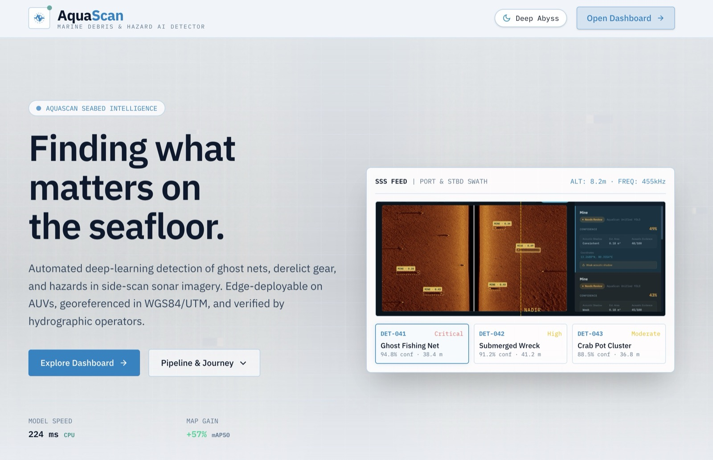

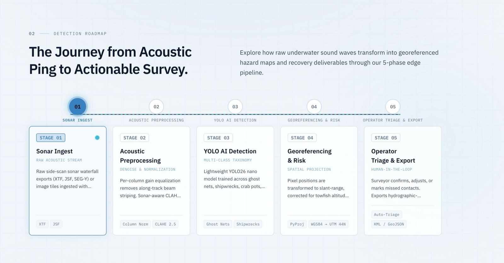

## Problem statement

**SIH26057 — Ministry of Earth Sciences / NIOT.** Side-scan sonar surveys of the seabed generate large
volumes of imagery that must be inspected manually to find hazards and marine debris: derelict fishing gear
and ghost nets, wrecks, and mine-like objects. Manual review is slow, expert-dependent and hard to scale,
and the findings are rarely turned into georeferenced, actionable outputs.

**Our approach:** automatically detect and classify seafloor objects in sonar imagery, georeference each
contact, triage by confidence so experts focus on ambiguous cases, and capture their corrections to keep
improving the model.

## Tech stack

| Layer | Technologies |
|---|---|
| Frontend | React 18, Vite, React Router, Leaflet / react-leaflet, jsPDF + html2canvas, Tailwind (landing only) + CSS variables theme |
| Backend | Python, FastAPI, Uvicorn |
| ML / CV | Ultralytics YOLO (YOLO26n deployed), PIL, OpenCV |
| Geospatial | pyproj (UTM ⇄ WGS84), Leaflet, KML export |
| Database | PostgreSQL on Neon (psycopg2, pooled) |
| Deployment | Vercel (frontend), Railway + Docker (backend), Neon (DB) |

## Tech architecture

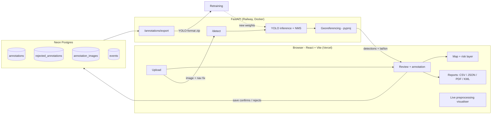

## What's actually real here

Worth being upfront about, since it matters for how this gets presented:

- **Detection is real.** A YOLO model trained across the full debris taxonomy runs on every upload — not a
  mock response. `ultralytics` + the actual `.pt` weight files run server-side on every `/detect` call,
  with NMS resolving overlapping boxes on the same tile.
- **Georeferencing is real.** Pixel offset → ground range → vessel heading → UTM, using `pyproj` against
  the nav fix supplied at upload (`backend/georef.py`). Not simulated coordinates.
- **The preprocessing pipeline shown in Review is real.** Per-column gain normalization and CLAHE contrast
  enhancement run live on the actual uploaded tile (`src/components/PipelineVisualizer.jsx`), not a
  pre-baked illustration.
- **The risk/accumulation-zone map layer is a heuristic, not a trained model.** It's a hand-weighted
  reference layer (port proximity, fishing density, shipping lanes, river outflow) for survey
  prioritization — labelled honestly as "known accumulation zones," not "AI-predicted."
- **Metrics and annotations now persist in Postgres (Neon)**, not local files — see
  [Persistence](#persistence--metrics) below.

## Pipeline

What actually happens to one uploaded tile, end to end:

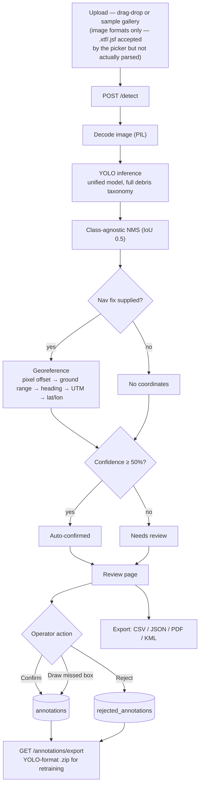

*(The live preprocessing visualizer on the Review page — column normalization + CLAHE — runs client-side
on the same uploaded tile in parallel with this, for operator inspection; it isn't a step the detection
request itself passes through.)*

**1. Ingest** (`src/pages/Upload.jsx` → `POST /detect`)
File comes in via drag-drop or the built-in sample gallery, alongside survey metadata (vessel, nav fix,
depth, altitude) — auto-filled from EXIF GPS when present, manual otherwise. `.xtf`/`.jsf`/`.segy` are
accepted by the file picker, but the backend only actually decodes standard raster images (`PIL.Image.open`,
`backend/main.py`) — there's no binary XTF/JSF/SEG-Y parser. Real sonar-format ingestion is scoped as
future work, not implemented.

**2. Preprocessing** (`src/components/PipelineVisualizer.jsx`, mirrors `backend` conceptually — see note below)
Per-column gain normalization (removes along-track striping inherent to side-scan waterfalls) and
sonar-aware CLAHE (clip limit 2.5) for local contrast, so a model trained on acoustic returns isn't fed a
raw, unequalized image. This runs client-side on the actual uploaded tile for the Review page's live
visualizer; the detection models themselves consume the raw image directly.

**3. Detection** (`backend/main.py::detect`)
A YOLO model (`ultralytics`), trained across the full taxonomy — crab pot, shipwreck, mine, ghost net,
unknown debris, person-in-water, airplane, non-mine object — runs inference on the tile. Class-agnostic
NMS (`_nms`, IoU 0.5) merges overlapping boxes.

**4. Acoustic-context overlay**
The Review page draws a shadow corridor next to each detection, illustrating the acoustic-shadow evidence
a human reviewer would check. This is a heuristic visualization (fixed corridor geometry relative to the
box), not a separately-trained shadow-classification model — worth knowing before presenting it as model
output.

**5. Confidence triage** (`src/utils/taxonomy.js::classifyConfidence`)
Each detection is auto-tiered: **≥ 50% confidence → auto-confirmed**, below that → needs-review. (Pick a
number and be consistent about it when presenting — a pitch deck earlier said 70%; the shipped code uses
50%.) Person-in-water detections always render as a distinct critical case regardless of confidence —
that one's never auto-buried.

**6. Georeferencing** (`backend/georef.py`)
For every kept detection: pixel offset from nadir → ground range → rotated by vessel heading → UTM
easting/northing → WGS84 lat/lon, via `pyproj`. Runs only when a nav fix (lat/lon/heading) was supplied
with the upload; otherwise detections have no coordinates.

**7. Operator review** (`src/pages/Review.jsx`, `src/components/AnnotationTool.jsx`)
Confirm, reject, or draw a missed box with a class picker. No separate "mark uncertain" action — that's
what the needs-review tier already is. Confirms/rejects/new boxes queue as pending until **Save & Next**.

**8. Persistence + retraining loop** (`backend/db.py`)
Save writes confirmed boxes to `annotations`, rejections to `rejected_annotations` (hard negatives), and
archives the source image — all to Postgres. `GET /annotations/export` rebuilds a YOLO-format training
`.zip` from those tables on demand; there's no automatic retraining trigger, a human runs that separately.

**9. Reporting** (`src/pages/Reports.jsx`, `src/utils/exportReport.js`, `src/utils/pdfReport.js`)
Filtered detection sets export as CSV, JSON, or a multi-section PDF. Map view adds KML export for
GIS tools (QGIS/ArcGIS-compatible).

## Screens

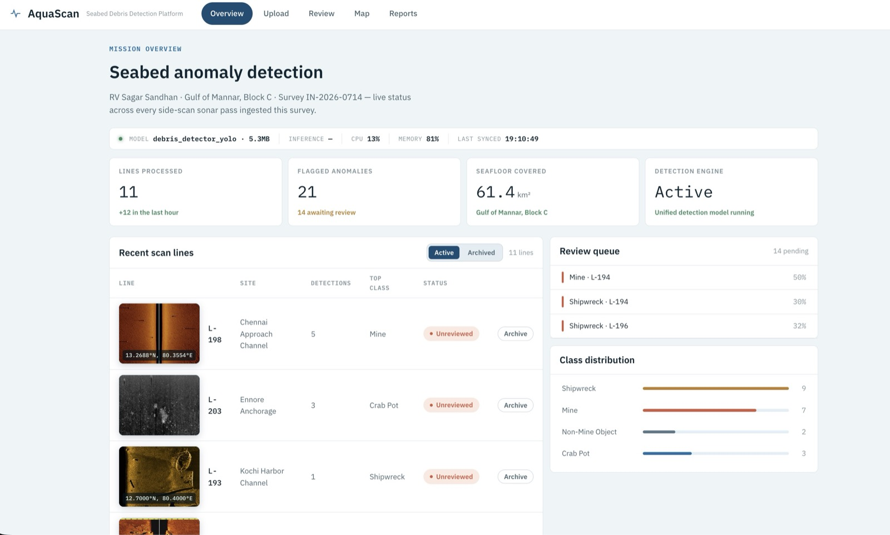

- **Overview** (`/dashboard`) — survey stats, live telemetry (model, inference time, CPU/memory, last
  synced), recent scan lines with Active/Archived filtering, review queue, class distribution.
- **Upload** (`/upload`) — drag-drop or a built-in sample gallery of real annotated sonar tiles; extracts
  EXIF GPS when present (e.g. drone imagery), otherwise leaves survey metadata for manual entry.
- **Review** (`/review/:lineId`) — the annotation tool: confirm/reject/draw boxes, confidence-based
  auto-triage (auto-confirmed / needs-review / rejected), the live Detection Pipeline visualizer, prev/next
  line navigation, and a scan-line gallery strip.

  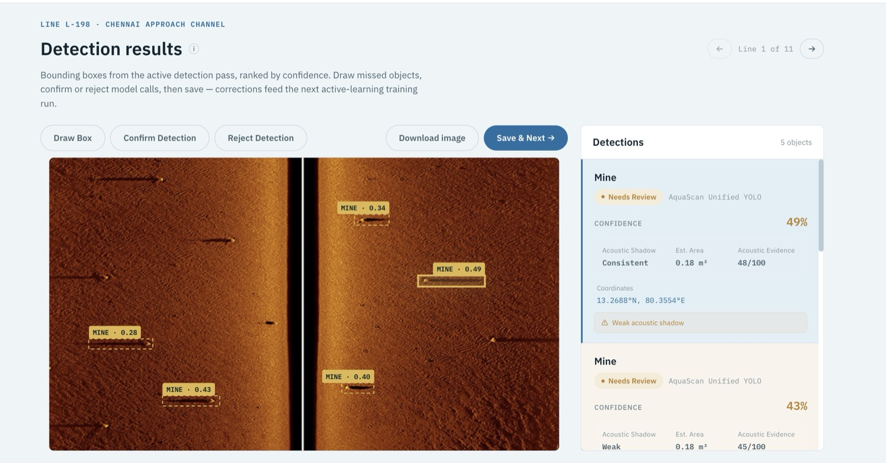

  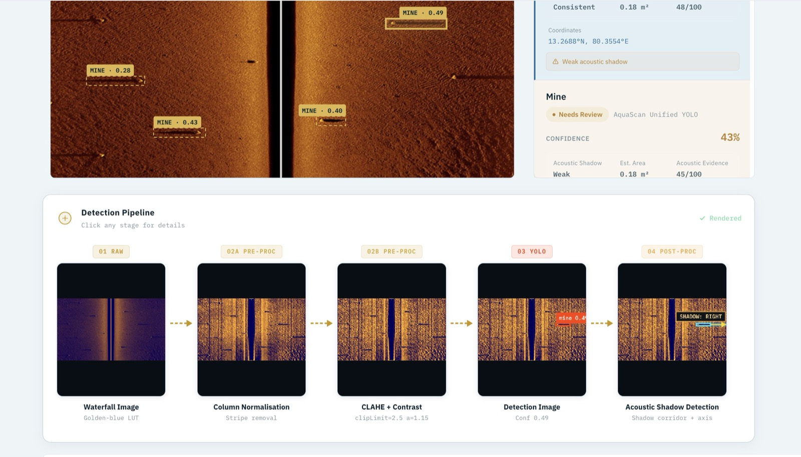

- **Map** (`/map`) — georeferenced detections plotted on Leaflet (OpenStreetMap / Esri satellite /
  hybrid), overlaid with the risk reference layer, KML export for GIS tools.

  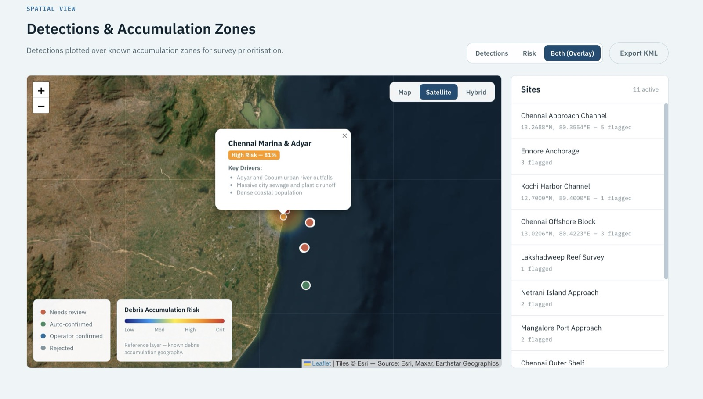

  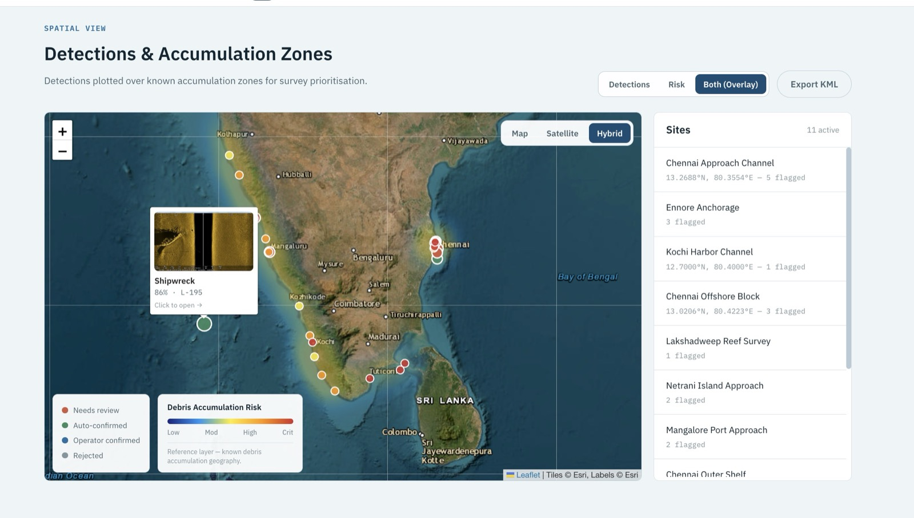

- **Reports** (`/reports`) — searchable/filterable detection archive (class, confidence threshold), export
  as CSV, JSON, or a multi-section PDF survey report.

## Results & metrics

All numbers are precision / recall / mAP50 on **our own held-out split** (not a public leaderboard), and
match the Benchmarks section of the landing page (`src/components/landing/Benchmarks.jsx`).

### 1. What sonar-specific preprocessing buys us

YOLO26n, crab-pot dataset, identical training setup:

| Configuration | Precision | Recall | mAP50 |
|---|---|---|---|
| Raw sonar imagery | 0.4730 | 0.4000 | 0.3835 |
| + column normalisation | 0.5962 | 0.4853 | 0.4592 |
| **+ sonar-aware augmentation** | **0.7449** | **0.6528** | **0.6021** |

**≈ +57% relative mAP50** over raw imagery (0.3835 → 0.6021).

### 2. Why we ship the smallest model

Identical ~3k-image dataset:

| Model | Precision | Recall | mAP50 | Size |
|---|---|---|---|---|
| **YOLO26n** (deployed) | 0.4730 | 0.4000 | 0.3860 | 5.3 MB |
| YOLO26s | 0.3995 | 0.4261 | 0.3735 | — |
| YOLO26m | 0.4710 | 0.4520 | 0.4260 | — |

Differences sit at or below our measured mAP50 noise floor (**±0.05**), so scaling the model up does not
reliably help on this data. The nano model is deployed.

### 3. Runtime

| Metric | Value |
|---|---|
| CPU inference per tile | **224 ms** |
| Throughput | **4.5 FPS** |
| Model size | **5.3 MB** |

> [!NOTE]
> The preprocessing table is for the crab-pot dataset; the production unified model covers more classes and
> its per-class metrics are not yet reported here. Treat the headline numbers as indicative, not a
> guarantee on unseen survey conditions.

## Risk & accumulation zones

The Map page overlays a **risk / accumulation-zone reference layer** (`public/data/risk_data.json`) on the
georeferenced detections, to help operators prioritise where to survey and recover first.

- **Inputs (hand-weighted):** port proximity, fishing density, shipping lanes, river outflow.
- **Honest labelling:** this is a heuristic reference layer for prioritisation — *not* a trained or
  "AI-predicted" model.
- **Detection severity tiers** (shown on the landing page and map legend):

| Tier | Typical classes | Meaning |
|---|---|---|
| Critical | Ghost nets, mines / ordnance, person-in-water | Immediate action; person-in-water is never auto-buried |
| High | Shipwrecks, crab pots | Navigational / ghost-fishing hazard |
| Moderate | Anchors, heavy cable, unknown debris | Recover when convenient |
| Eco-protected | Coral / sensitive habitat buffers | Flag proximity of debris to protected areas |

- **Basemaps:** OpenStreetMap, Esri satellite, hybrid. **Exports:** KML for QGIS/ArcGIS.


> [!NOTE]
> The tier colours/labels on the landing page gallery are illustrative showcase data. The layer is static
> today; aggregating real detection density from the `annotations`/`events` tables is the next step.

## Impact

Side-scan sonar surveys produce hours of mostly empty seafloor. AquaScan changes the operator's job from
scrubbing everything to **reviewing the ambiguous detections**.

- **Faster surveys** — operators start from the needs-review queue instead of raw waterfalls.
  The landing page cites **~10× faster triage** (a target estimate, not yet measured in a field trial).
- **Ghost-net / derelict-gear recovery** — every contact carries coordinates and confidence, so recovery
  crews can be sent to the likeliest sites first. Landing page frames the opportunity as **~640k tonnes**
  of gear lost annually (sector-level figure, not something this system measures).
- **Safer navigation** — wrecks and mine-like contacts are flagged and positioned before a vessel crosses
  the line; person-in-water is always surfaced as a critical case.
- **Better models over time** — every confirm / reject / drawn box becomes training data (hard negatives
  included), so the model improves with use.
- **Expert-in-the-loop, not replacement** — aligned with the MoES / NIOT problem statement (SIH26057).

## Feasibility

| Area | Status |
|---|---|
| Detection (YOLO, server-side) | ✅ Working, deployed |
| Georeferencing (`pyproj`, UTM → WGS84) | ✅ Working, needs a nav fix at upload |
| Review / annotation / active-learning data loop | ✅ Working, Postgres-backed |
| Reports (CSV / JSON / PDF) + KML | ✅ Working |
| Live preprocessing visualiser | ✅ Working (client-side) |
| Risk-zone layer | ⚠️ Static heuristic data |
| Native `.xtf` / `.jsf` / SEG-Y ingestion | ❌ Not implemented (raster images only) |
| Automatic retraining trigger | ❌ Manual export + train |
| Edge packaging (ONNX / TFLite) | 🔜 Proposed, see below |

**Why it is practical:** a 5.3 MB model on CPU, a standard FastAPI + Postgres stack, free-tier friendly
hosting (Vercel, Railway, Neon), and open formats (YOLO labels, KML, CSV) that slot into existing GIS
workflows.

**Main risks:** limited and class-imbalanced sonar data, domain shift between sonar systems and seabed
types, and the need for real-format ingestion before using live survey output.

## Scalability

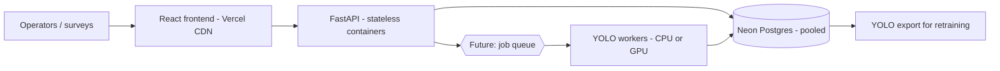

- **Stateless API in Docker** — scale horizontally by adding replicas; no local disk state (annotations
  moved from files to Postgres for this reason).
- **Pooled DB connections** (Neon pooler) and **batched inserts** on save.
- **Small model** — 224 ms/tile on CPU means one core handles roughly 4–5 tiles/s; cost scales linearly.
- **Per-tile processing** — each tile is independent, so batches parallelise naturally; class-agnostic NMS
  merges overlapping boxes within a tile. (Stitching detections across tile borders is not implemented.)
- **Not yet built:** async job queue for batch surveys, GPU workers, object storage for large images
  (currently image bytes are archived in Postgres), multi-tenant auth and per-survey projects.

## Edge deployment

Because the shipped model is just **5.3 MB** and runs at **~4.5 FPS on CPU**, it is a good fit for
drone-/vessel-class hardware with no GPU.

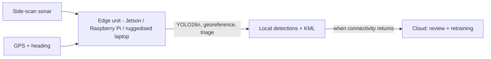

**Proposed path (not implemented yet):** export weights to ONNX / TFLite, run the same georeferencing
module on-device, store detections locally, and sync to the cloud when bandwidth allows. This gives
at-sea, near-real-time hazard flags (mines, wrecks, person-in-water) without a satellite uplink, with the
cloud app used for review, reporting and retraining.

## Roadmap

- Native XTF / JSF / SEG-Y parsers.
- Replace static risk layer with density aggregated from confirmed detections over time.
- Per-class metrics on the production unified model; larger, more diverse sonar datasets.
- ONNX / TFLite export and an edge runtime.
- Automatic retraining pipeline, job queue, and object storage.
- Auth and multi-survey project management.

## Architecture

```
┌──────────────────┐      ┌──────────────────────┐      ┌─────────────────┐
│  React + Vite     │ ───► │  FastAPI backend      │ ───► │  Neon Postgres   │
│  (Vercel)          │      │  (Railway, Docker)     │      │  annotations,    │
│  src/              │      │  backend/main.py       │      │  rejections,      │
│                    │      │  YOLO (ultralytics)    │      │  images, events   │
└──────────────────┘      └──────────────────────┘      └─────────────────┘
```

- **Frontend** — React 18 + Vite, React Router, Leaflet/react-leaflet for the map, jsPDF + html2canvas for
  the PDF report, Tailwind (scoped to the landing page only — the dashboard uses its own CSS-variable
  theme system, see `src/index.css`).
- **Backend** — FastAPI, `ultralytics` (YOLO), `pyproj` (georeferencing), `psycopg2` (Postgres). Deployed
  via a Dockerfile (not Railway's auto-detected builder — needed to install OpenCV's system libraries that
  `ultralytics`'s transitive `opencv-python` dependency requires but doesn't declare).
- **Database** — Neon (serverless Postgres), connected via a pooled connection string.

## Running it locally

### Frontend

```bash
npm install
npm run dev
```

Opens on `http://localhost:5173`. Set `VITE_API_BASE_URL` in a `.env` file to point it at a backend
(defaults to `http://localhost:8000`).

### Backend

```bash
cd backend
python3 -m venv venv
source venv/bin/activate
pip install -r requirements.txt
uvicorn main:app --reload --port 8000
```

Needs a `.env` at the **project root** (not `backend/`) with:

```
DATABASE_URL=postgresql://...
DATABASE_URL_POOLED=postgresql://...   # used preferentially — Neon's pooled endpoint
```

(`backend/db.py` loads it from the parent directory since `main.py` runs from inside `backend/`.)

Model weights live in `backend/models/` (`.pt` files, tracked in git — see note below) and load
automatically on startup; `/health` reports which ones loaded.

## Persistence & metrics

Originally annotations were written to local files (`backend/annotations/`) — that didn't survive a
redeploy on any host with ephemeral disk. `backend/db.py` now persists everything to Postgres instead:

| Table | What |
|---|---|
| `annotations` | Confirmed operator corrections (YOLO-format box + class) |
| `rejected_annotations` | Explicitly rejected model calls — hard negatives for retraining |
| `annotation_images` | The source image bytes for each reviewed line |
| `events` | Lightweight usage metrics — one row per `/detect` call and per review save, with counts and timing |

`GET /annotations/export` rebuilds a YOLO-format training `.zip` directly from Postgres. Saves batch all
inserts over a single connection (opening a new connection per row was the original implementation and
was measurably slow over a real network — see commit history).

## Notes for anyone continuing this

- **Model weights are committed to git**, which is unusual but deliberate — `backend/models/**/*.pt` is
  *not* gitignored. A GitHub-based deploy needs the actual weight files; they were originally excluded,
  which meant the deployed backend loaded zero models until that was fixed.
- **The Railway backend uses a Dockerfile**, not Railpack/Nixpacks auto-detection, specifically to apt-install
  `libgl1`/`libxcb1`/etc. — `ultralytics` pulls in full `opencv-python` as a transitive dependency even
  though `requirements.txt` pins `opencv-python-headless`, and the conflict leaves a `cv2` binary that's
  missing X11 shared libraries on a minimal image.
- **`VITE_API_BASE_URL` must have no trailing slash.** A trailing slash produces `BASE_URL + '/health'` →
  a double slash, which FastAPI treats as a different, non-existent route.
- The risk/accumulation layer (`public/data/risk_data.json`) is static reference data — if you want it to
  reflect real detection density over time, it needs to aggregate from the `annotations`/`events` tables
  instead of being hand-authored. Not done yet; noted as the obvious next step.
